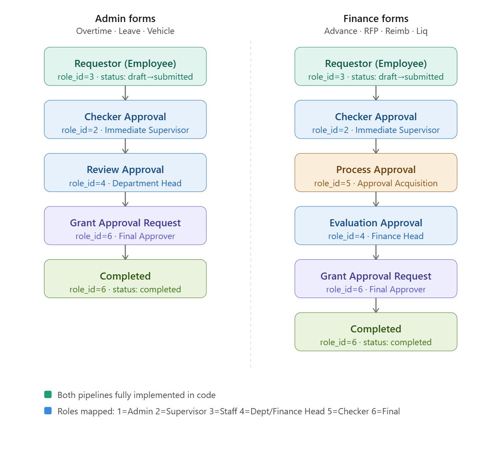
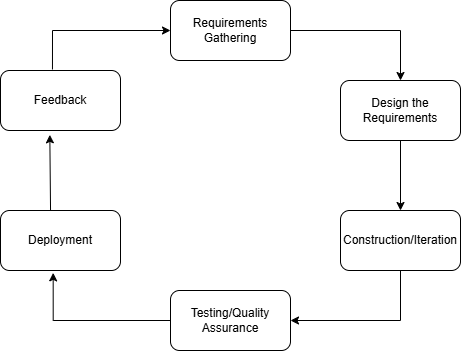

### AUTOMATED-PROCESSING-SYSTEM (APS)
System for SMEs for paperless and make the indicated features below automated, get record online and easy.

## FEATURES

- **Advance Payment Form**  
  Allows employees to request advance payments for anticipated expenses, subject to approval.

- **Overtime Authorization Form**  
  Used to request and approve overtime work, ensuring proper documentation and authorization.

- **Request for Payment Form**  
  Enables submission of payment requests for services, purchases, or obligations.

- **Work Permit Form**  
  Facilitates the application and approval of permits required before starting specific tasks or projects.

- **Leave Application Form**  
  Allows employees to apply for leave (e.g., vacation, sick leave) and track approval status.

- **Reimbursement Form**  
  Used to claim repayment for business-related expenses already paid by the employee.

- **Liquidation Form**  
  Helps document and reconcile expenses against previously issued cash advances.

- **Vehicle Request Form**  
  Allows users to request company vehicles for official use, including scheduling and approval.

## FUTURE FEATURES
- **multilevel_approval** -- Submit request for approval
                              Move request to next approval level
                              Approve / reject actions
                              Fetch approval status

## TECH-STACK
- *PHP*
- *MySQL*

## TOOLS TO USE
- *Composer*
- *PHPMailer*
- *vlucas/phpdotenv*
- *Bootstrap 5*

## DB DESIGN
- **users** -- employees + roles (admin, approver, staff)
- **forms** -- generic: id, type, status, submitted_by, created_at
- **form_data** -- JSON or EAV for form-specific fields
- **approvals** -- approval chain: form_id, approver_id, status, remarks
- **audit_logs** -- who did what and when

## PROJECT-STRUCTURE
```
    processing-system/
    ├── app/
    │   ├── Controllers/        # Business logic per form
    │   ├── Models/             # DB interactions
    │   ├── Middleware/         # Auth, role checks
    │   └── Helpers/            # Reusable utilities
    ├── config/
    │   ├── database.php
    │   └── app.php
    |   └── psdb.sql
    ├── public/                 # Entry point, assets
    │   └── index.php
    ├── views/
    │   ├── layouts/            # Base templates
    │   └── forms/              # One view per form
    ├── routes/
    │   └── web.php
    ├── migrations/             # DB schema versioning
    └── .env                    # Environment config (never commit)
```
### System Process Flow


### SDLC - AGILE MODEL
This project uses Agile Model to adapt to sudden and quick client project request.

### The Agile Model
is a type of approach iterative and incremental process models. 
### The phases involve in Agile (SDLC) Model are: 
- **Requirement Gathering**
- **Design the Requirements**
- **Construction / Iteration**
- **Testing / Quality Assurance**
- **Deployment**
- **Feedback**



### Workflow Schema Design
```
    processing-system
    ├── app/
    │   ├── controllers/        # Business logic per form
    |   |   ├── ApprovalController.php
    |   |   ├── AuthController.php
    |   |   ├── EmployeeController.php
    |   |   ├── FormController.php
    |   |   ├── FormsController.php
    |   |   └── NotificationController.php
    |   |
    |   ├── helpers/            # Reusable utilities
    |   |   ├── csrf.php
    |   |   ├── EmployeeCode.php
    |   |   └── FormLabels.php
    |   |
    |   ├── middleware/
    |   |   ├── AuthMiddleware.php
    |   |   └── RoleMiddleware.php
    |   |
    |   ├── model/            # DB interactions
    |   |   └── Approval.php
    |   |
    |   └── services/
    |       └── NotificationService.php
    |
    ├── config/
    |   ├── app.php
    |   ├── database.php
    |   └── psdb.sql
    |
    ├── public/
    |   ├── scripts
    |   ├── stylesheets
    |   ├── .htaccess
    |   └── index.php
    |
    ├── routes/
    |   └── web.php
    |
    ├── vendor/
    |   ├── composer
    |   ├── graham-campbell
    |   ├── phpmailer
    |   ├── phpoption
    |   ├── symfony
    |   ├── vlucas
    |   └── autoload.php
    |   
    ├── views/
    |   ├── approvals/
    |   |   └── inbox.php
    |   ├── auth/
    |   |   ├── login.php
    |   |   └── authchange/
    |   |       ├── forgot_password.php
    |   |       └── reset_password.php
    |   ├── employees/
    |   |   ├── index.php
    |   |   ├── create.php
    |   |   └── edit.php
    |   |
    |   ├── error/
    |   |   └── error.php
    |   |
    |   ├── forms/
    |   |   ├── advance_payment_form.php
    |   |   ├── leave_application_form.php
    |   |   ├── overtime_authorization_form.php
    |   |   ├── reimbursement_form.php
    |   |   ├── request_for_payment.php
    |   |   ├── vehicle_request_form.php
    |   |   ├── liquidation_form.php
    |   |   ├── approval_trail.php
    |   |   ├── all_requests.php
    |   |   ├── list.php
    |   |   ├── pipeline_stepper.php
    |   |   └── show.php
    |   ├── images    # images use for project
    |   |
    |   ├── layouts/
    |   |   ├── base.php
    |   |   └── dashboard.php
    |   |
    |   └── profile/
    |       └── index.php  
    |   
    ├── .gitignore
    |
    ├── composer.json
    |
    ├── composer.lock
    |
    ├── hash.php
    | 
    ├── package-lock.json
    |
    └── README.md      # Overview of the project   


