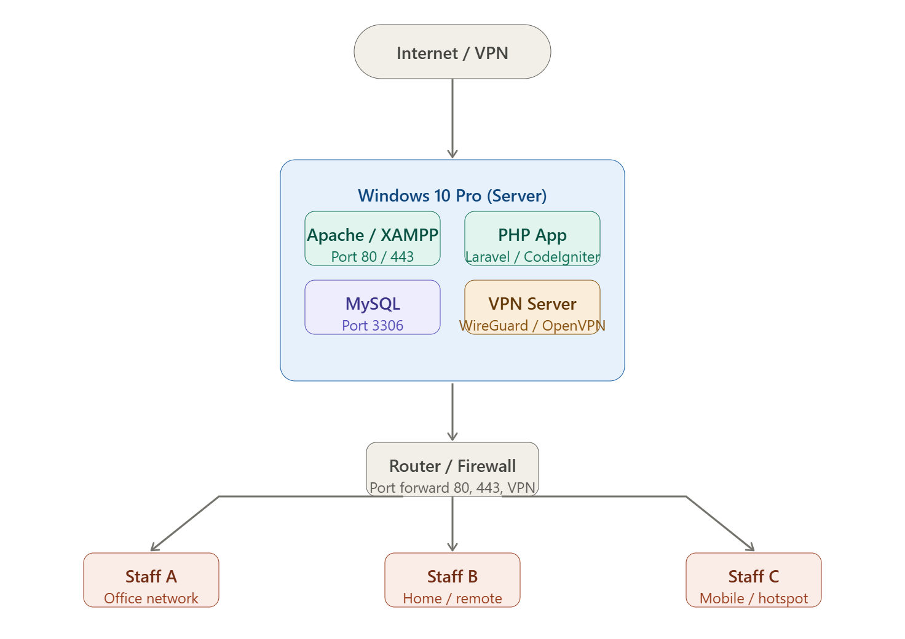

### SETUP WITH SERVER



## Step 1 — Install XAMPP (Apache + PHP + MySQL)

1. Download **XAMPP** from [apachefriends.org](https://www.apachefriends.org) — choose the PHP 8.x version.
2. Install to `C:\xampp`. During setup, select Apache, MySQL, PHP, and phpMyAdmin.
3. Open the **XAMPP Control Panel** and start Apache and MySQL.
4. Put your PHP project in `C:\xampp\htdocs\yourapp\`.
5. Test locally: open `http://localhost/yourapp` in your browser.

---

## Step 2 — Configure Apache for network access

By default Apache only listens on localhost. Edit `C:\xampp\apache\conf\httpd.conf`:

```
# Find this line and make sure it says:
Listen 0.0.0.0:80
```

Also set a virtual host in `conf\extra\httpd-vhosts.conf`:

```apache
<VirtualHost *:80>
    DocumentRoot "C:/xampp/htdocs/yourapp"
    ServerName yourapp.local
    <Directory "C:/xampp/htdocs/yourapp">
        AllowOverride All
        Require all granted
    </Directory>
</VirtualHost>
```

Restart Apache from the XAMPP Control Panel after saving.

---

## Step 3 — Set a static local IP on your Windows 10 server

Go to **Settings → Network & Internet → Change adapter options** → right-click your adapter → Properties → IPv4:

| Field | Example value |
|---|---|
| IP address | `192.168.1.100` |
| Subnet mask | `255.255.255.0` |
| Default gateway | `192.168.1.1` (your router) |
| DNS | `8.8.8.8` |

---

## Step 4 — Windows Firewall rules

Open **Windows Defender Firewall with Advanced Security** and create inbound rules:

```
Rule type: Port
Protocol: TCP
Port: 80, 443
Action: Allow
Profile: All (Domain, Private, Public)
Name: PHP App HTTP
```

Repeat for port `1194` (OpenVPN) or `51820` (WireGuard) depending on which VPN you choose.

---

## Step 5 — Allow remote staff access (two options)

### Option A — VPN (Recommended, most secure)

Install **WireGuard** on the server (free, fast, easy):

1. Download from [wireguard.com](https://www.wireguard.com/install/)
2. Generate a server config — WireGuard has a GUI that does this for you.
3. Each staff member installs WireGuard on their device and gets a `.conf` file from you.
4. Once connected via VPN, staff access the app at `http://192.168.1.100/yourapp` — same as being on your local network.

### Option B — Port forwarding (simpler, less secure)

If staff only need browser access and VPN setup is too complex:

1. Log into your router admin page (usually `192.168.1.1`).
2. Find **Port Forwarding** (sometimes under NAT or Virtual Servers).
3. Add a rule: External port `80` → Internal IP `192.168.1.100` port `80`.
4. Staff access via your **public IP** (find it at [whatismyip.com](https://whatismyip.com)): `http://your.public.ip/yourapp`.

> For port forwarding, consider adding a **dynamic DNS** service like [No-IP](https://noip.com) or [DuckDNS](https://duckdns.org) so staff use a hostname like `yourapp.ddns.net` instead of an IP that can change.

---

## Step 6 — HTTPS (optional but recommended)

If using port forwarding with a domain name, get a free SSL cert via **Certbot + Let's Encrypt**. If using VPN only, a self-signed cert is fine since the tunnel is already encrypted.

---

## Recommended stack summary

| Component | Software | Why |
|---|---|---|
| Web server | Apache (via XAMPP) | Easy setup on Windows |
| Language | PHP 8.x | Latest stable |
| Database | MySQL 8 (via XAMPP) | Included with XAMPP |
| Framework | Laravel or CodeIgniter | Full MVC, routing, auth |
| Remote access | WireGuard VPN | Fast, secure, free |
| Dynamic DNS | DuckDNS | Free, auto-updates |

---

Let me know your PHP framework preference (Laravel, CodeIgniter, plain PHP?) and I can help with the app setup or VPN config in more detail.